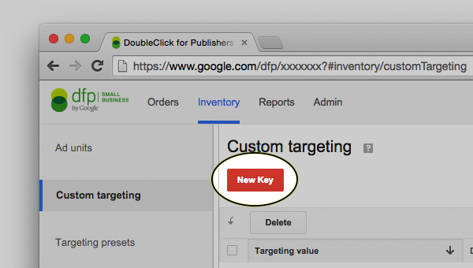
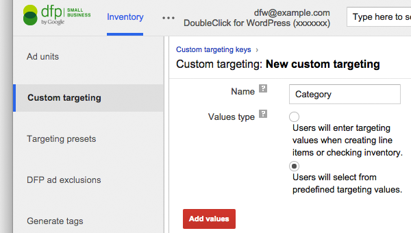
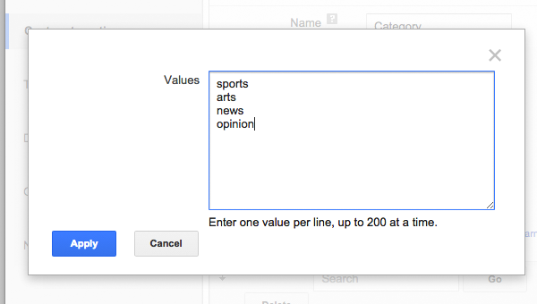
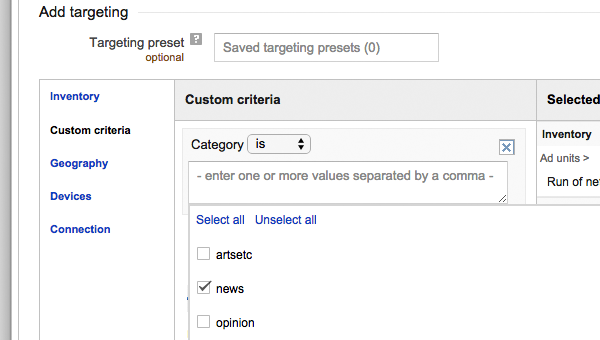

# Targeting

This plugin implements advanced Google Ad Manager targeting criteria to allow trafficers to specify pages or groups of pages where line items should serve.

* * *

## 1. Example

A local restaurant might wish to only have their ads shown a landing page and related article pages for a publisher's food category.

_In the above example, this line item is targeting all posts in the Category "food"._

* * *

## 2. Available targeting criteria

The following WordPress and general targeting criteria are defined for each ad call:

#### WordPress Targeting —

Targeting criteria specific to WordPress variables.

 - `Page` → Target the [type of page](http://codex.wordpress.org/Conditional_Tags).

 	> Takes the values of 'home', 'front-page', 'admin', 'admin-bar-showing', 'single', 'archive', 'author', 'date' or 'search'. 

 - `Category` → On single pages, target based on WordPress category. The value(s) passed are the WordPress slug for the category.

  > 
 
 - `Tag` → On single pages, target based on WordPress tags. The value(s) passed are the WordPress slug for the tag.

#### URL Targeting —

Additional targeting criteria set by the URL of the page.

 - `inURL` → Target a piece of the page path.

	> __eg__. targeting the string '__/dvds__' would match [example.com**/dvds**/](http://example.com/dvds/), [example.com**/dvds**/page1](http://example.com/dvds/page1) and [example.com**/dvds**/page2](http://example.com/dvds/page2)

 - `URLIs` → Target the entire page path.

	> __eg__. targeting the string '__/books__' will **only** match [example.com**/books**](http://example.com/books/) and not [example.com**/books/page1**](http://example.com/books/page1). (Note: Any trailing '/' is removed.)

 - `Domain` → Target based on the domain.

	> eg. run different advertising on [staging.example.com](http://staging.example.com) and [example.com](http://example.com).

 - `Query` → Target a ?query var.

	> eg. target the url [example.com/?**movie=12**](http://example.com/news/) with the targeting string 'p:12'

__Warning__: Targeting strings are limited to 40 characters long by Google Ad Manager. Targeting URLIs or domains longer than that will result in error.

This plugin uses `jQuery.dfp.js`, which provides [a number of other targeting parameters](https://github.com/coop182/jquery.dfp.js#default-url-targeting).

* * *

## 3. Defining targeting criteria in Google Ad Manager

Google Ad Manager needs to be told what filter keys exist before they can be used.

#### Example

In Inventory > Custom Targeting, hit "New Key," 

Enter a name for the key and "values type" to indicate whether this key is static or dynamic.

For the purposes of this tutorial, we will use the `Category` targeting key. Also for our purposes, we will assume the site has a small number of predefined categories, such as "sports", "arts", "news" and "opinion". This is better suited for a value type of _"Users will select from predefined targeting values"_ (__static__).

If a key is more __dynamic__, such as a blog that uses hundreds of categories, "values type" should be set it _"Users will enter targeting values when creating line items or checking inventory"_

On the next screen enter values the key could take. This will be a list of categories, unique domains, url segments, tags, &c.

#### Using the targeting criteria

Now, when creating a line item, select "custom criteria" from the left hand menu under targeting. After entering a targeting key, select one or more options:

This line item will show only on article pages that belong in the news category. 

The [available targeting criteria](#2-available-targeting-criteria) section above contains more information about what is possible with different criteria.

