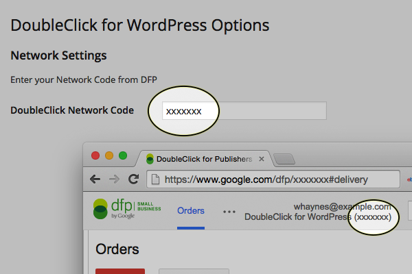
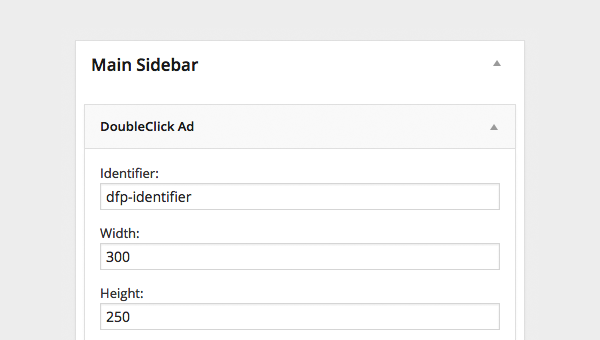

#  DoubleClick for WordPress

Serve DoubleClick ads natively in WordPress. Built to make serving responsive ads easy.

Built by the [Institute for Nonprofit News](http://inn.org/), DoubleClick for WordPress works with [Project Largo](http://largoproject.org/) or any standalone WordPress blog.

* * *

## 1. What is this thing?

This WordPress plugin serves inventory from a DoubleClick for Publisher account on a WordPress site.

No need to copy and paste ad codes or header tags — the plugin generates all of this on its own.

* * *

## 2. How do I use it?

For the most basic integration, only two steps are necessary.

#### __2.1. Define Settings__ —

Under _Settings > DoubleClick for WordPress_ update the field with your network code from DFP, and a place to define breakpoints to serve ads to.

**NOTE:** Both Network Code and Breakpoints may be defined by a developer within the WordPress theme. If a developer already defined these values within the theme, a user will know based on their display in the plugin Settings page.

#### __2.2 Placing Advertisements__ —

Advertisements are placed in two ways.

##### 1. Via Reusable Widget

 * The __identifier__ field is the name of a line item in DoubleClick for Publishers. If an line item with the same identifier in DoubleClick matches the identifier set in the widget, the ad will load (subject to conditional targeting set in DFP admin). If the identifier is blank or doesn't match a line item in DFP, the plugin attempts to load inventory from anywhere in the DFP account.

 * Based on breakpoints defined in plugin settings or theme, an __Inventory Size__ can be defined for each breakpoint set either in the plugin settings or via theme function.
   * For an ad the same __Inventory Size__ at every breakpoint, use that size in each breakpoint (i.e. `300x250`).
   * For an ad with multiple __Inventory Sizes__ (and corresponding creatives), define the appropriate Inventory Size for each breakpoint (i.e. `320x50` for a mobile breakpoint, `728x90` for tablet and desktop breakpoints).

* * *

##### 2. Via Theme Function

See [Developer API](Developer-API.md) documentation.

## 3. Is that it?

Nope! Next [configure targeting](Targeting.md) and advanced users may look at the [developer api](developer-api/).
